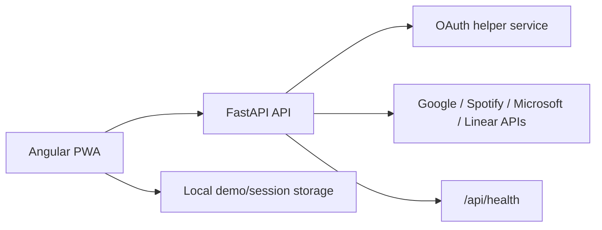

# Dashboardy

Dashboardy is an offline-capable productivity dashboard built with Angular 17 and FastAPI. It brings calendar, Spotify, and Linear-style task data into one local-first interface, with a clear demo mode for running the project without third-party credentials.

This is a full-stack portfolio project, not a production SaaS product. The repository is designed to show frontend architecture, API structure, OAuth integration design, PWA/offline thinking, Docker-based local development, and maintainable documentation.

## Features

- Angular 17 standalone-component frontend with Angular Material
- FastAPI backend with structured routes for auth, calendar, Spotify, Linear, and health checks
- Demo mode that works without OAuth credentials
- PWA manifest and Angular service worker configuration
- Light/dark theme support
- Docker Compose for local development
- Backend smoke test and GitHub Actions CI
- Documentation for setup, frontend, backend, OAuth, and PWA behavior

## Tech Stack

- Frontend: Angular 17, Angular Material, RxJS, TypeScript
- Backend: FastAPI, Uvicorn, Pydantic, python-dotenv
- Integrations: OAuth structure for Google, Spotify, Microsoft; Linear API-key route examples
- Local development: Docker Compose, npm, Python virtualenv
- Quality: GitHub Actions, backend health smoke test

## Architecture



Repository layout:

```text
frontend/             Angular application
backend/              FastAPI application
backend/tests/        Backend smoke tests
docs/                 Extended project documentation
docs/screenshots/     Local screenshot assets and instructions
docker-compose.yml    Local multi-service development
```

## Demo Mode vs Real Integrations

Dashboardy intentionally runs without provider credentials. In demo mode:

- the dashboard shell loads normally
- sample calendar and task data are shown
- settings, theme switching, responsive layout, and offline messaging can be reviewed
- provider menu actions create local demo sessions in the frontend

Real provider calls require credentials in `backend/.env`. Google, Spotify, and Microsoft have OAuth URL/callback structure in the backend. Linear is currently represented as an API-key integration example, not a completed OAuth flow.

The frontend currently defaults to demo mode through `frontend/src/environments/environment*.ts`. Disable `demoMode` only after backend credentials and callback URLs are configured.

## Screenshots

Screenshots should be stored under `docs/screenshots/` before sharing the repository publicly.

| View | Local path | Status |
| --- | --- | --- |
| Dashboard, light theme | `docs/screenshots/dashboard-light.png` | To add |
| Dashboard, dark theme | `docs/screenshots/dashboard-dark.png` | To add |
| Settings and demo mode | `docs/screenshots/settings.png` | To add |
| Mobile layout | `docs/screenshots/mobile.png` | To add |

See [docs/screenshots/README.md](./docs/screenshots/README.md) for capture notes. External placeholder image services are intentionally not used.

## Quick Start With Docker

```bash
git clone https://github.com/iboruch/dashboardy.git
cd dashboardy
docker compose up --build
```

Open:

- Frontend: `http://localhost:4200`
- Backend API: `http://localhost:8000`
- Swagger docs: `http://localhost:8000/docs`
- Health check: `http://localhost:8000/api/health`

Copy `backend/.env.example` to `backend/.env` only when you want to configure real provider credentials.

## Manual Local Setup

Prerequisites:

- Node.js 20 recommended for the Angular frontend (`cd frontend && nvm use`)
- Python 3.11 recommended for the FastAPI backend

Backend:

```bash
cd backend
python3 -m venv venv
source venv/bin/activate
pip install -r requirements.txt
cp .env.example .env
python main.py
```

Frontend in a second terminal:

```bash
cd frontend
nvm use
npm install
npm start
```

For a browser-opening local frontend command, use:

```bash
npm run start:local
```

## OAuth Callback URLs

Use these callback URLs when creating local provider apps:

- Google: `http://localhost:4200/auth/google/callback`
- Spotify: `http://localhost:4200/auth/spotify/callback`
- Microsoft: `http://localhost:4200/auth/microsoft/callback`
- Linear: `http://localhost:4200/auth/linear/callback` planned; current backend examples use an API key

## Current Status

- The app runs locally as an Angular frontend plus FastAPI backend.
- Demo mode is the default and is safe to run without secrets.
- The dashboard, settings screen, theme switching, and app shell are implemented.
- OAuth provider structure exists, but real integrations require credentials and further hardening.
- Some user actions are intentionally marked as coming soon instead of appearing fully functional.

## Known Limitations

- Live provider data is not fully wired through the frontend.
- Token refresh and provider token revocation are not implemented.
- Linear is modeled as an API-key integration example, not a complete OAuth implementation.
- Persistence is local/demo-oriented; production storage and session handling would need redesign.
- PWA/offline support is configured, but production-grade offline sync conflict handling is not implemented.

## What This Project Demonstrates

This project is meant to show practical full-stack judgment rather than claim production completeness:

- Angular frontend structure: standalone components, Angular Material UI, service-based state boundaries, routing, theming, and responsive dashboard/settings screens.
- FastAPI backend API design: grouped routers, typed Pydantic schemas, a health endpoint, provider-specific route boundaries, and clearer errors when credentials are missing.
- OAuth integration architecture: separate OAuth helper service, provider callback structure, documented redirect URLs, and honest handling of unfinished token refresh/revocation work.
- PWA/offline support: manifest and Angular service worker configuration, local demo/session storage, and UI copy that distinguishes configured offline support from full offline sync.
- Docker-based development: Compose starts the Angular and FastAPI services together, with Dockerfiles and `.dockerignore` files kept focused on local development.
- Safe demo mode: mock/demo sessions and sample data let reviewers run the app without secrets, while real provider credentials stay out of Git.
- Documentation quality: README as the entry point, focused setup docs, OAuth/PWA notes, screenshot guidance, known limitations, and production considerations.
- Maintainability and extension points: provider services, frontend data/auth/theme services, environment-based demo mode, and CI smoke checks make the project easier to extend in an interview or future iteration.

## Production Considerations

Before treating this as a production application, add secure server-side token storage, CSRF/state validation persistence, refresh-token handling, provider revocation, real database-backed user sessions, observability, stricter CORS, HTTPS-only deployment, and broader test coverage.

## Roadmap

- Wire frontend data services to real provider responses when tokens are configured
- Add proper OAuth state/session persistence
- Add token refresh and disconnect flows
- Add frontend tests for dashboard and settings states
- Capture and commit real screenshots
- Add deployment notes for a hosted demo environment

## Suggested Repository Topics

`angular`, `fastapi`, `pwa`, `oauth`, `docker`, `typescript`, `python`, `portfolio-project`, `productivity-dashboard`

## Extended Docs

- [Quickstart](./QUICKSTART.md)
- [Setup Guide](./SETUP.md)
- [Frontend Guide](./docs/FRONTEND.md)
- [Backend Guide](./docs/BACKEND.md)
- [OAuth Guide](./docs/OAUTH.md)
- [PWA Guide](./docs/PWA.md)
- [Contributing](./CONTRIBUTING.md)
- [Security](./SECURITY.md)
